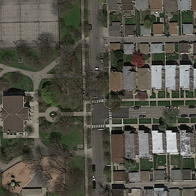

# Road Segmentation project


This repositery contains the work achieved by Salomé BAUP, Tanguy DESJARDIN and Antoine LAPERRIERE during the fall 2022 semester for the second project of the CS-433 Machine Learning course of EPFL.
\
The goal of the project is to identify roads on satellite images extracted from google maps using a machine learning model. The training dataset consists of images and their corresponding groundtruth where the road corresponds to white pixels and the rest is black.
<p float="left">


</p>

The train and test datasets are stored in the `data/` folder.
\
In order to reproduce our prediction, you can install the required libraries using the following command:
\
(note that the trainings have been performed on macOS with a M1 Max GPU using python 3.9.15 and on Windows with a Nvidia GPU using python 3.9.13)

Run the following command to create a conda virtual environment:
```bash
conda create --name road_segmentation python=3.9.15
conda activate road_segmentation   
```

If you are using MacOS with an ARM architecture run:

```bash
pip install -r requirements_mac_m1.txt
```

If you are using Windows with a Nvidia GPU run:

```bash
pip install -r requirements_windows_cuda.txt
```

| Flag                  | Type             | Default                 | Description                                                                     | 
| --------------------- |------------------|-------------------------|---------------------------------------------------------------------------------|
| data_path             | str              | "../data"               | Dataset path.                                                                   |
| train                 | ast.literal_eval | True                    | Train the model if true                                                         |
| test                  | ast.literal_eval | True                    | Make prediction on test set if true                                             |
| validation_ratio      | float            | 0                       | Set validation ratio                                                            |
| device                | str              | cpu                     | Choose the device on which to train the model (cpu, cuda or mps)                |
| lr                    | float            | 0.001                   | Set the learning rate                                                           |
| experiment_name       | str              | Unidentified_Experiment | Number of random erasings per image.                                            |
| loss                  | str              | dice                    | Choose the type of loss (dice, BCE or dice + BCE)                               |
| save_weights          | ast.literal_eval | False                   | Save weights after every epoch if True                                          |
| epoch                 | int              | 100                     | Set the number of epochs                                                        |
| model                 | str              | UNet                    | Set the model on which to train (UNet or ResNet50)                              |
| flip                  | ast.literal_eval | False                   | Flip images if true (horizontally and vertically)                               |
| rotation              | ast.literal_eval | False                   | Rotate images if true                                                           |
| grayscale             | ast.literal_eval | False                   | Apply grayscale on some images if true                                          |
| erase                 | int              | 0                       | Number of random erase per images                                               |
| batch_size            | int              | 8                       | Select the batch size                                                           |
| opti                  | str              | Adam                    | Select the optimizer (Adam or Adamax)                                           |

\
To retrain the best model we obtained you can run the following command on mac0S:
```bash
PYTORCH_ENABLE_MPS_FALLBACK=1 python -W ignore main.py --data_path "../data" --train True --test True --validation_ratio 0.2 --device "mps"  --lr 0.001 --experiment_name "R_K" --loss "dice" --save_weights True --epochs 100 --model "ResNet50" --flip True --rotation True --grayscale True --erase 5 --batch_size 32 --opti "Adam"
```

or on Windows:

```bash

python main.py --data_path "../data" --train True --test True --validation_ratio 0.2 --device "cuda"  --lr 0.001 --experiment_name "R_K" --loss "dice" --save_weights True --epochs 100 --model "ResNet50" --flip True --rotation True --grayscale True --erase 5 --batch_size 32 --opti "Adam"
```

Once the computation is done, the prediction and the models are stored in the `experiment_name` folder.


To obtain the predictions that make our best predictions, you can use a pretrained models, the pretrained model is stored on this google drive folder. The model is located here `R_K/R_K.pt` and have to be placed in the experiments folder on your computer.


To obtain the result with a pretrained model you can run the following command on mac0S:
```bash
PYTORCH_ENABLE_MPS_FALLBACK=1 python main.py --data_path "../data" --model "ResNet50" --train False --validation_ratio 0 --test True --device "mps" --weights_path "../experiments/R_K/R_K.pt" --experiment_name "R_K"
```

or on windows:

```bash
python main.py --data_path "../data" --model "ResNet50" --train False --validation_ratio 0 --test True --device "cuda" --weights_path "../experiments/R_K/R_K.pt" --experiment_name "R_K"
```


# Contributors
* Salomé BAUP
* Tanguy DESJARDIN
* Antoine LAPERRIERE

# Citation
```bash
@misc{MMLS,
  Author = {Salomé BAUP, Tanguy DESJARDIN \& Antoine LAPERRIERE},
  Title = {EPFL CS-433, Road segmentation project - magical_mandrills},
  Year = {2022},
  Publisher = {GitHub},
  Journal = {GitHub repository},
  Howpublished = {\url{https://github.com/CS-433/ml-project-2-magical_mandrills}}
```
